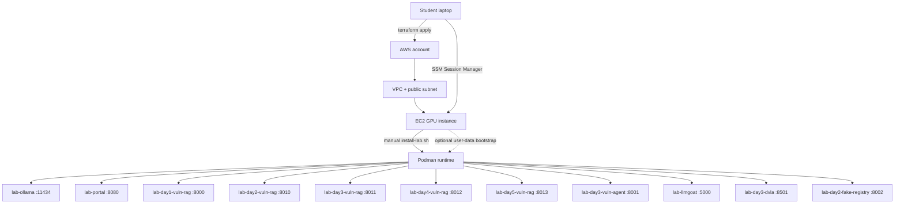
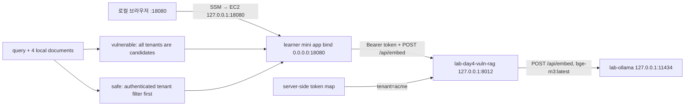

# Architecture

## 전체 흐름



## Terraform

`infrastructure/terraform`이 생성하는 리소스입니다.

- 기존 검증 계열의 최신 AWS DLAMI 조회
- VPC `10.42.0.0/16`
- Public subnet `10.42.10.0/24`
- Internet Gateway와 route table
- 수강생별 security group
- 수강생별 IAM role과 instance profile
- 수강생별 EC2 GPU 인스턴스. 기본값은 `g6.xlarge`
- AWS Budget 알람

수강생 수가 여러 명이면 `student_ids` 목록만큼 EC2가 생성됩니다.

기본 AMI 조회 기준은 우리가 기존 실습에서 사용한 계열과 같습니다.

```hcl
ami_owner_id     = "898082745236"
ami_name_pattern = "Deep Learning OSS Nvidia Driver AMI GPU PyTorch 2.11 (Ubuntu 24.04)*"
```

AMI ID나 SHA를 직접 고정하지 않습니다. Terraform은 위 조건에 맞는 가장 최신 AMI를 새 EC2 생성 시 선택합니다. 이후 더 최신 AMI가 공개돼도 이미 생성된 수강생 EC2는 자동 교체하지 않으며, 기존 EBS와 작업 상태를 그대로 유지합니다.

강사가 Packer로 만든 커스텀 골든 AMI를 사용할 때만 예를 들어 아래처럼 override합니다.

```hcl
ami_owner_id     = "self"
ami_name_pattern = "owasp-llm-lab-*"
```

## Security group

실습 앱은 의도적으로 취약합니다. 그래서 기본값은 외부 직접 접속을 닫습니다.

```hcl
allowed_ingress_cidr = "127.0.0.1/32"
```

직접 접속이 꼭 필요한 경우에만 본인 공인 IP `/32`를 사용하세요.

## 설치 방식

기본값은 수동 설치입니다.

1. Terraform이 EC2를 생성합니다.
2. 수강생이 SSM으로 EC2에 접속합니다.
3. 수강생이 `install-lab.sh`를 직접 실행합니다.

```bash
curl -fsSL https://raw.githubusercontent.com/gasbugs/owasp-llm-lab-setup-guide/main/infrastructure/scripts/student/install-lab.sh | sudo bash
```

`infrastructure/scripts/student/install-lab.sh`의 핵심 작업은 다음과 같습니다.

- EC2 metadata와 tag를 읽어 `/etc/lab/env` 작성
- `/home/ubuntu/work` 생성
- Podman rootless와 Quadlet 실행 환경 설치
- NVIDIA CDI 파일 생성
- 공개 GHCR에서 실습 이미지 anonymous pull
- Ollama와 실습 앱 컨테이너 실행
- Ollama 모델 pull과 warm-up
- Podman Quadlet 기반 systemd user unit 등록
- Terraform 기본 설정으로 매일 17:30 KST Lambda 기반 EC2 자동 중지 등록. `auto_stop_schedule_mode`로 야간 반복 모드 또는 custom cron 선택 가능

운영 편의상 자동 설치가 필요하면 `terraform.tfvars`에서 아래 값을 켭니다.

```hcl
enable_user_data_bootstrap = true
```

이때 `infrastructure/terraform/user-data.sh.tpl`은 최초 부팅 시 `install-lab.sh`를 내려받아 실행하는 얇은 래퍼로 동작합니다. 자동 설치와 수동 설치가 같은 스크립트를 공유하므로 설치 내용은 동일합니다.
Terraform의 `lab_image_namespace`와 `lab_image_tag`도 user-data가 설치 스크립트에 전달하며, 설치 로그와 `/etc/lab/env`에 실제 선택값이 남습니다. 강사용 검증은 설치 스크립트 URL과 이미지 태그를 같은 main commit에 고정합니다.

인스턴스는 수강생 데이터를 보존하기 위해 `user_data_replace_on_change = false`를 사용합니다. 따라서 user-data 관련 변수를 바꿔도 이미 생성된 인스턴스에서 bootstrap이 재실행되거나 인스턴스가 자동 교체되지 않습니다. pin은 최초 apply 전에 설정하고, 기존 인스턴스는 수동 재설치 또는 명시적인 교체 절차를 사용합니다.

## 컨테이너

| 컨테이너 | 포트 | 역할 |
|---|---:|---|
| `lab-ollama` | 11434 | 생성 모델과 LLM08 `bge-m3:latest` embedding을 함께 제공하는 로컬 Ollama API |
| `lab-portal` | 8080 | 실습 앱 링크와 health check 진입점 |
| `lab-day1-vuln-rag` | 8000 | Day 1 LLM01 프롬프트 인젝션 RAG 챗봇 |
| `lab-day2-vuln-rag` | 8010 | Day 2 LLM02·LLM04 Bank/RAG 챗봇 |
| `lab-day3-vuln-rag` | 8011 | Day 3 LLM05 output handling RAG 챗봇 |
| `lab-day4-vuln-rag` | 8012 | Day 2 LLM08의 `/api/embed`·paired vector search/chat과 Day 4 LLM07·LLM09가 공유하는 PrivateGPT-Lite |
| `lab-day5-vuln-rag` | 8013 | Day 5 LLM10 resource consumption RAG 챗봇 |
| `lab-day3-vuln-agent` | 8001 | 의도적으로 취약한 tool-calling Agent |
| `lab-llmgoat` | 5000 | LLMGoat cross-platform 실습 |
| `lab-day3-dvla` | 8501 | Damn Vulnerable LLM Agent 실습 |
| `lab-day2-fake-registry` | 8002 | Day 4 LLM03 공급망 실습용 fake registry. 브라우저/API 확인 경로는 `/api/v1/models` |

## LLM08 embedding dataflow와 경계

LLM08 수강생 앱 scaffold는 `examples/llm08/mini_vector_search_app.py`에 있습니다. 설치·검증·종료 순서는 [LLM08 embedding lab setup](LLM08-SETUP.md)을 정본으로 사용합니다.



`0.0.0.0`은 미니 앱이 모든 IPv4 인터페이스에서 연결을 받도록 지정하는 bind sentinel이지 접속 URL이 아닙니다. 학생은 전용 EC2/SSM 터미널에서 Python 서버를 foreground로 실행하고, 두 번째 EC2/SSM 터미널에서는 `127.0.0.1:18080`으로 health/API를 확인합니다. Terraform Security Group은 TCP/18080을 `allowed_ingress_cidr`의 IPv4 `/32`에만 허용합니다. 기본 `127.0.0.1/32`에서는 SSM port forwarding을 사용하고, 운영자가 자신의 공인 IPv4 `/32`로 설정해 Terraform을 적용한 환경에서만 `EC2_PUBLIC_IP:18080` 직접 접속이 가능합니다. 미니 앱의 upstream `TARGET_URL`도 계속 loopback `127.0.0.1:8012`로 제한됩니다.

`vulnerable`과 `safe`는 같은 embedding model과 cosine 함수를 사용합니다. 차이는 ranking 이후 결과를 가리는 것이 아니라, **embedding/ranking 후보를 만들기 전에 인증 tenant metadata filter를 적용하는가**입니다. 미니 앱은 운영 vector DB가 아닌 교육용 인메모리 검색기입니다.

| 경계/endpoint | 노출 범위 | 인증·입력 계약 | 용도 |
|---|---|---|---|
| Ollama `POST :11434/api/embed` | EC2 내부 host network | Day 4 backend가 고정 model로 호출 | 실제 embedding 생성 |
| Day 4 `POST :8012/api/embed` | EC2 loopback/SSM | Bearer token을 server-side principal/tenant로 변환; body tenant 불허 | 학습자 분석과 미니 앱의 vector source |
| Day 4 `POST :8012/api/labs/llm08/{vulnerable,safe}/search` | EC2 loopback/SSM | 동일 인증 context, filter 위치만 다름 | 구조화된 hit 비교 |
| Day 4 `GET :8012/api/lab/llm08/target-vector` | EC2 loopback/SSM | Bearer token 필요; fixture plaintext는 응답하지 않음 | 제한된 vector 단서 추정 실습 |
| 미니 앱 `POST :18080/api/search` | process는 `0.0.0.0` bind; Terraform TCP/18080은 `allowed_ingress_cidr` IPv4 `/32`만 허용, 기본 `127.0.0.1/32`에서는 EC2 loopback/SSM | `query`, `mode`, `top_k`만 허용; body tenant 거부 | 학습자 구현 공격·수정 |

LLM08 endpoint는 `DEFAULT_SCENARIO=day4` 컨테이너에서만 활성화합니다. `retrieved_chunks`, embedding, target fixture 같은 필드는 교육용 관측 endpoint의 출력이며 운영 API 계약이 아닙니다. Terraform이 만드는 TCP/18080 ingress는 `allowed_ingress_cidr` IPv4 `/32`만 받습니다. 직접 접속을 위해 자신의 공인 IPv4 `/32`를 사용하거나, 이미 승인된 수동 all-protocol 규칙이 그 `/32`에 한정된 경우에만 18080이 도달 가능합니다. 권장하는 최소 규칙은 TCP/18080 단일 포트이며 `0.0.0.0/0`은 사용하지 않습니다. 8012와 11434도 public internet에 공개하지 않습니다.

## 이미지 빌드

강사가 이미지를 수정한 경우 정식 release는 GitHub Actions가 내장 `GITHUB_TOKEN`으로 `ghcr.io/gasbugs`에 push합니다. CI 장애를 조사할 때만 `docker/build-and-push.sh`를 수동으로 사용합니다.

```bash
cd docker
podman login ghcr.io
IMAGE_NAMESPACE=your-github-id TAG="sha-$(git rev-parse HEAD)" ./build-and-push.sh
```

기본 설치 스크립트는 공개 `ghcr.io/gasbugs/...` 이미지를 인증 없이 pull합니다. 별도 GHCR namespace를 쓰려면 `install-lab.sh` 실행 시 환경변수로 조정하세요.

```bash
curl -fsSL https://raw.githubusercontent.com/gasbugs/owasp-llm-lab-setup-guide/main/infrastructure/scripts/student/install-lab.sh \
  | sudo IMAGE_NAMESPACE=your-github-id bash
```
