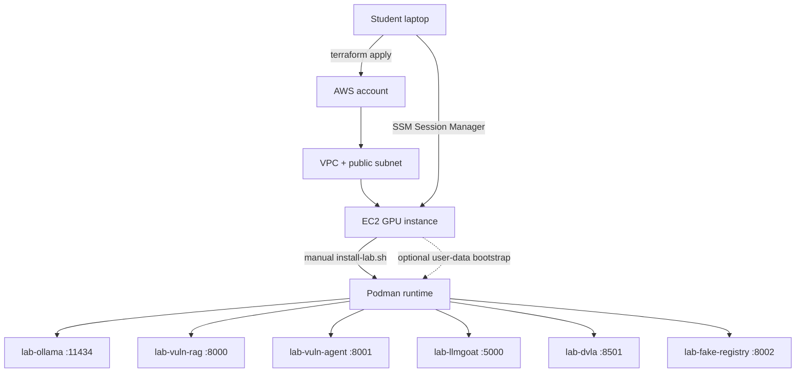

# Architecture

## 전체 흐름



## Terraform

`infrastructure/terraform`이 생성하는 리소스입니다.

- 기존 검증 계열의 최신 AWS DLAMI 조회
- VPC `10.42.0.0/16`
- Public subnet `10.42.10.0/24`
- Internet Gateway와 route table
- 학생별 security group
- 학생별 IAM role과 instance profile
- 학생별 EC2 GPU 인스턴스. 기본값은 `g6.xlarge`
- AWS Budget 알람

학생 수가 여러 명이면 `student_ids` 목록만큼 EC2가 생성됩니다.

기본 AMI 조회 기준은 우리가 기존 실습에서 사용한 계열과 같습니다.

```hcl
ami_owner_id     = "898082745236"
ami_name_pattern = "Deep Learning OSS Nvidia Driver AMI GPU PyTorch 2.11 (Ubuntu 24.04)*"
```

강사가 Packer로 만든 커스텀 골든 AMI를 사용할 때만 예를 들어 아래처럼 override합니다.

```hcl
ami_owner_id     = "self"
ami_name_pattern = "owasp-llm-lab-*"
```

## Security group

실습 앱은 의도적으로 취약합니다. 그래서 기본값은 외부 직접 접속을 닫습니다.

```hcl
allowed_ingress_cidr = "127.0.0.1/32"
```

직접 접속이 꼭 필요한 경우에만 본인 공인 IP `/32`를 사용하세요.

## 설치 방식

기본값은 수동 설치입니다.

1. Terraform이 EC2를 생성합니다.
2. 수강생이 SSM으로 EC2에 접속합니다.
3. 수강생이 `install-lab.sh`를 직접 실행합니다.

```bash
curl -fsSL https://raw.githubusercontent.com/gasbugs/owasp-llm-lab-setup-guide/main/infrastructure/scripts/student/install-lab.sh | sudo bash
```

`infrastructure/scripts/student/install-lab.sh`의 핵심 작업은 다음과 같습니다.

- EC2 metadata와 tag를 읽어 `/etc/lab/env` 작성
- `/home/ubuntu/work` 생성
- Podman, podman-compose, rootless 실행 환경 설치
- NVIDIA CDI 파일 생성
- Docker Hub에서 실습 이미지 pull
- Ollama와 실습 앱 컨테이너 실행
- Ollama 모델 pull과 warm-up
- Podman Quadlet 기반 systemd user unit 등록
- Terraform 기본 설정으로 매일 17:30 KST Lambda 기반 EC2 자동 중지 등록. `auto_stop_schedule_mode`로 야간 반복 모드 또는 custom cron 선택 가능

운영 편의상 자동 설치가 필요하면 `terraform.tfvars`에서 아래 값을 켭니다.

```hcl
enable_user_data_bootstrap = true
```

이때 `infrastructure/terraform/user-data.sh.tpl`은 최초 부팅 시 `install-lab.sh`를 내려받아 실행하는 얇은 래퍼로 동작합니다. 자동 설치와 수동 설치가 같은 스크립트를 공유하므로 설치 내용은 동일합니다.

## 컨테이너

| 컨테이너 | 포트 | 역할 |
|---|---:|---|
| `lab-ollama` | 11434 | 로컬 LLM API |
| `lab-vuln-rag` | 8000 | 의도적으로 취약한 RAG 챗봇. Day 1~5 시나리오를 한 앱에서 선택 |
| `lab-vuln-agent` | 8001 | 의도적으로 취약한 tool-calling Agent |
| `lab-llmgoat` | 5000 | LLMGoat cross-platform 실습 |
| `lab-dvla` | 8501 | Damn Vulnerable LLM Agent 실습 |
| `lab-fake-registry` | 8002 | LLM03 공급망 실습용 fake registry. 브라우저/API 확인 경로는 `/api/v1/models` |

## 이미지 빌드

강사가 이미지를 수정한 경우 `docker/build-and-push.sh`로 Docker Hub에 push합니다.

```bash
cd docker
podman login docker.io
DOCKERHUB_NAMESPACE=your-dockerhub-id ./build-and-push.sh
```

기본 설치 스크립트는 `docker.io/gasbugs/...` 이미지를 pull합니다. 별도 namespace를 쓰려면 `install-lab.sh` 실행 시 환경변수로 조정하세요.

```bash
curl -fsSL https://raw.githubusercontent.com/gasbugs/owasp-llm-lab-setup-guide/main/infrastructure/scripts/student/install-lab.sh \
  | sudo IMAGE_NAMESPACE=your-dockerhub-id bash
```
