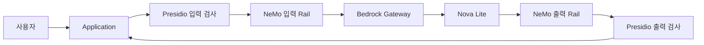

# Presidio·NeMo Guardrails 구성 안내

가드레일 실습은 GPU 없는 WSL의 Docker Engine·Compose v2에서 진행한다. 생성·일반 위해 검사·애플리케이션 Self-check는 Amazon Bedrock의 `us.amazon.nova-lite-v1:0`을 사용한다. AWS 자격 증명은 로컬 Bedrock Gateway만 보유하며, 다른 서비스는 Gateway Token으로 모델을 요청한다.

## 독립 도구에서 통합 서비스까지

수강생은 [교재의 가드레일 단원](https://github.com/gasbugs/owasp-top-10-for-llm/tree/main/02-bedrock-guardrails-observability/03-llm-guardrails)을 순서대로 진행한다. 처음부터 완성 스택을 배포하지 않는다.

| 단계 | 실행 대상과 역할 | setup 정본 |
|---|---|---|
| 독립 NeMo | 정책과 Action을 작성하고 Dialog·Self-check 동작 확인 | [NeMo 소스](../examples/guardrails/nemo-guardrails/) |
| 독립 Presidio | 개인정보 탐지·비식별화를 먼저 확인 | [Presidio 소스](../examples/guardrails/presidio/) |
| 직렬 연결 | Presidio가 입력·출력을 검사하고 NeMo가 모델 호출 전후 Rail 실행 | [직렬 연결 안내](../examples/guardrails/README.md) |
| Application 통합 | 인증·인가와 최종 응답 결정을 Application에서 집행 | [Control Plane](../llm-security-control-plane/README.md) |
| 관측 연결 | 기존 Application의 Log·Trace·Metric을 수집 | [관측 스택](../examples/security-monitoring/README.md) |

직렬 연결 단계의 요청 흐름은 다음과 같다. 최종 Application 통합은 별도의 Hub·Spoke 구성이므로 해당 README의 흐름을 따른다.

Rail은 요청이나 응답이 다음 단계로 넘어가기 전에 실행하는 검사 규칙이다. Presidio의 탐지 결과 자체가 사용자 인증이나 데이터 접근 권한을 대신하지 않으며, 최종 통합에서는 Application이 이를 별도로 판단한다.

## CLI와 HTTP 서버의 경계

`--suite`, `--case`, Presidio의 `--text`·`--direction`은 공식 제품 CLI가 아니라 이 저장소의 학습용 실행기가 제공하는 옵션이다. CLI와 HTTP 서버는 각각 같은 `presidio_core.py` 또는 `nemo_core.py`를 사용한다. Presidio CLI는 이미지에 포함된 NLP 모델로 오프라인 실행할 수 있지만 NeMo의 모델 검사에는 준비된 Bedrock Gateway가 필요하다.

Containerfile·빌드 명령·서비스 환경값은 [직렬 연결 README](../examples/guardrails/README.md)와 해당 교재를 따른다. `GUARD_MODE` 변경은 컨테이너 재생성 후 반영된다. 탐지 규칙 수정과 같은 규칙의 집행 여부 변경은 구분한다.

## 접속과 상태 보존

WSL의 직렬 연결 포트는 Application `18090`, Presidio `18091`, NeMo `18092`이며 loopback에만 publish한다. 최종 통합 포트와 서비스 경계는 [runtime-contract.yaml](../llm-security-control-plane/runtime-contract.yaml)에 있다. 컨테이너 간 요청은 같은 Docker network의 서비스 이름과 내부 포트를 사용한다.

Ollama·GPU·EC2는 이 경로의 선행 조건이 아니다. 기존 GPU 실습이나 다른 테넌트의 컨테이너·모델·volume을 삭제하지 않는다. 옛 `deploy-module08-complete.sh`는 실행을 중단하고 이 안내만 출력한다. 기존 데이터 삭제와 GPU 기반 재배포를 막기 위한 호환 안내이며, 새 배포를 수행하는 명령이 아니다.
